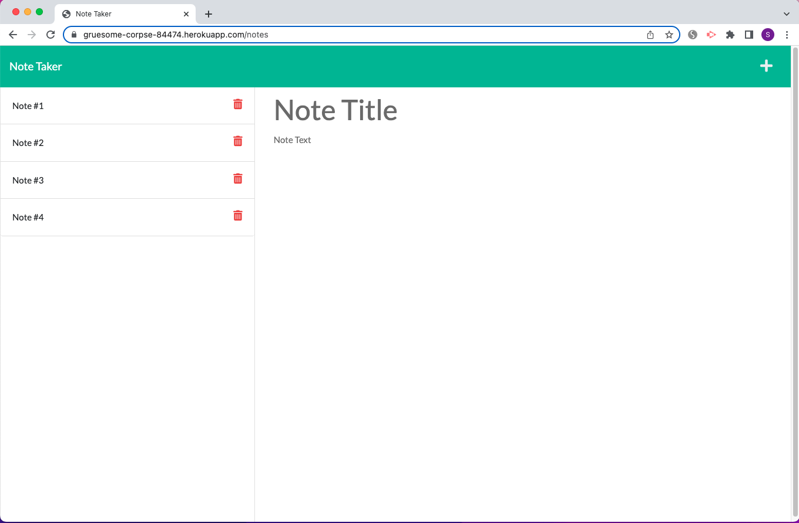
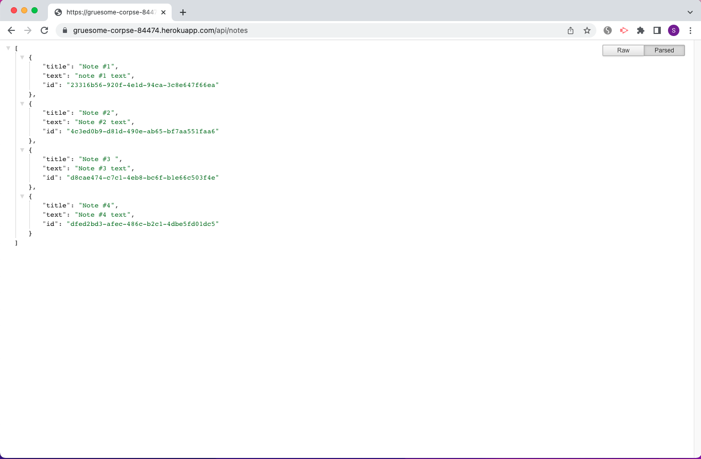

# Note Taker

## Description

A note taker web application to write, save and delete notes. It uses express.js and node.js.

## Installation

Run `npm i` to install dependencies and `npm start` to start the app.

## Usage

[Note Taker link](https://gruesome-corpse-84474.herokuapp.com/)

Screenshots:

## Credit

[Starter code](https://github.com/coding-boot-camp/miniature-eureka) 

## License

Please refer to the LICENSE in the repo.
